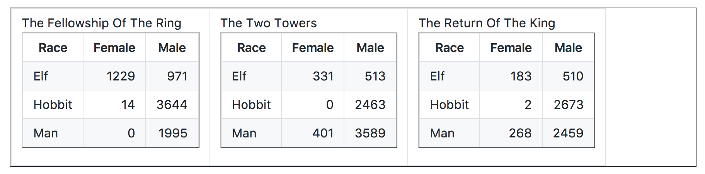

tidyr Tutorial
================
Katharine Sedivy-Haley and Amy Lee (@minisciencegirl)
2018-07-05

Outline
-------

1.  [Why Tidy?](#why-tidy)
2.  [How to Tidy](#how-to-tidy)
    -   Challenge Question 1
    -   Challenge Question 2
3.  [Other useful functions from tidyr](#other-useful-functions-from-tidyr): Separate and Unite
    -   Challenge Question 3
4.  [Final Example](#final-example): See how Kate used tidyr last week!
5.  [Further Reading](#further-reading)
6.  [Solutions](#solutions) for Challenge Questions

Why Tidy?
---------

### Tidy Data and Data Analysis Pipeline


> It is often said that 80% of data analysis is spent on the process of cleaning and preparing the data. (Dasu and Johnson, 2003)

### What is tidy data?

-   every column in your dataframe represents a variable
-   every row represents an observation
-   also known as long format

### Why do we need tidy data?

-   consistent data structure - easier to manipulate
-   preferred format for `dplyr` and `ggplot2`

> If you are struggling to make a figure, for example, stop and think hard about whether your data is tidy. Untidiness is a common, often overlooked cause of agony in data analysis and visualization. (Jenny Bryan, STAT545)

### Example of untidy data (Jenny Bryan, STAT545)



### Example of *tidy* data


### Consider the differences...

-   What are the variables and observations?
-   What makes the first set tidy while the second is untidy?
-   Which is easier on the eyes?
-   How would you figure out:
    -   What's the total number of words spoken by male hobbits in all three movies?
    -   Is there a more talkative `Race`?

Using a previously saved tidied dataset, we can see it is very easy to manipulate the tidy version:

``` r
library(tidyverse)
```

    ## Loading tidyverse: ggplot2
    ## Loading tidyverse: tibble
    ## Loading tidyverse: tidyr
    ## Loading tidyverse: readr
    ## Loading tidyverse: purrr
    ## Loading tidyverse: dplyr

    ## Conflicts with tidy packages ----------------------------------------------

    ## filter(): dplyr, stats
    ## lag():    dplyr, stats

``` r
lotr_tidy_pre <- read_csv("lotr_tidy.csv") 
```

    ## Parsed with column specification:
    ## cols(
    ##   Film = col_character(),
    ##   Race = col_character(),
    ##   Gender = col_character(),
    ##   Words = col_integer()
    ## )

``` r
lotr_tidy_pre %>% 
  count(Gender, Race, wt = Words)
```

    ## # A tibble: 6 x 3
    ##   Gender   Race     n
    ##    <chr>  <chr> <int>
    ## 1 Female    Elf  1743
    ## 2 Female Hobbit    16
    ## 3 Female    Man   669
    ## 4   Male    Elf  1994
    ## 5   Male Hobbit  8780
    ## 6   Male    Man  8043

``` r
lotr_tidy_pre %>%
  group_by(Race) %>%
  summarize(Words = sum(Words))
```

    ## # A tibble: 3 x 2
    ##     Race Words
    ##    <chr> <int>
    ## 1    Elf  3737
    ## 2 Hobbit  8796
    ## 3    Man  8712

Note: for explanations of the `%>%`, `count`, `group_by`, or `summarize` operations, see Jenny Bryan's dplyr material: [part 1 with the pipe](http://stat545.com/block009_dplyr-intro.html) and [part 2 dplyr functions](http://stat545.com/block010_dplyr-end-single-table.html).

How to Tidy
-----------

### How do we turn the LotR tables into a tidy dataframe?

Let's read these dataframes in:

``` r
fship <- read_csv("The_Fellowship_Of_The_Ring.csv")
```

    ## Parsed with column specification:
    ## cols(
    ##   Film = col_character(),
    ##   Race = col_character(),
    ##   Female = col_integer(),
    ##   Male = col_integer()
    ## )

``` r
ttow <- read_csv("The_Two_Towers.csv")
```

    ## Parsed with column specification:
    ## cols(
    ##   Film = col_character(),
    ##   Race = col_character(),
    ##   Female = col_integer(),
    ##   Male = col_integer()
    ## )

``` r
rking <- read_csv("The_Return_Of_The_King.csv")
```

    ## Parsed with column specification:
    ## cols(
    ##   Film = col_character(),
    ##   Race = col_character(),
    ##   Female = col_integer(),
    ##   Male = col_integer()
    ## )

``` r
fship #look at one untidy dataframe
```

    ## # A tibble: 3 x 4
    ##                         Film   Race Female  Male
    ##                        <chr>  <chr>  <int> <int>
    ## 1 The Fellowship Of The Ring    Elf   1229   971
    ## 2 The Fellowship Of The Ring Hobbit     14  3644
    ## 3 The Fellowship Of The Ring    Man      0  1995

Collect untidy dataframes into one dataframe:

``` r
(lotr_untidy <- dplyr::bind_rows(fship, ttow, rking))
```

    ## # A tibble: 9 x 4
    ##                         Film   Race Female  Male
    ##                        <chr>  <chr>  <int> <int>
    ## 1 The Fellowship Of The Ring    Elf   1229   971
    ## 2 The Fellowship Of The Ring Hobbit     14  3644
    ## 3 The Fellowship Of The Ring    Man      0  1995
    ## 4             The Two Towers    Elf    331   513
    ## 5             The Two Towers Hobbit      0  2463
    ## 6             The Two Towers    Man    401  3589
    ## 7     The Return Of The King    Elf    183   510
    ## 8     The Return Of The King Hobbit      2  2673
    ## 9     The Return Of The King    Man    268  2459

This dataframe is still untidy because "word count" is spread out between two columns, `Male` and `Female`. So to make this dataframe tidy, we need to:

-   `gather()` up the word counts into one column
-   create a new column for `Gender`

Time to make this dataframe tidy!

``` r
(lotr_tidy <-
  gather(lotr_untidy, key = 'Gender', value = 'Words', Female, Male))
```

    ## # A tibble: 18 x 4
    ##                          Film   Race Gender Words
    ##                         <chr>  <chr>  <chr> <int>
    ##  1 The Fellowship Of The Ring    Elf Female  1229
    ##  2 The Fellowship Of The Ring Hobbit Female    14
    ##  3 The Fellowship Of The Ring    Man Female     0
    ##  4             The Two Towers    Elf Female   331
    ##  5             The Two Towers Hobbit Female     0
    ##  6             The Two Towers    Man Female   401
    ##  7     The Return Of The King    Elf Female   183
    ##  8     The Return Of The King Hobbit Female     2
    ##  9     The Return Of The King    Man Female   268
    ## 10 The Fellowship Of The Ring    Elf   Male   971
    ## 11 The Fellowship Of The Ring Hobbit   Male  3644
    ## 12 The Fellowship Of The Ring    Man   Male  1995
    ## 13             The Two Towers    Elf   Male   513
    ## 14             The Two Towers Hobbit   Male  2463
    ## 15             The Two Towers    Man   Male  3589
    ## 16     The Return Of The King    Elf   Male   510
    ## 17     The Return Of The King Hobbit   Male  2673
    ## 18     The Return Of The King    Man   Male  2459

### Challenge Question 1

Sometimes you want a wide or untidy dataset - for example, making a table for human eyes. `spread()` is another tidyr function that converts a dataframe from the long format to the wide format. How would you convert the `lotr_tidy` dataframe back into the `lotr_untidy` dataframe?

### Challenge Question 2

In the EDAWR dataset, `cases`, we have the number of tuberculosis cases reported in France, Germany and United States from 2011 to 2013. What are the total number of tuberculosis cases reported over three years for each country?

``` r
#devtools::install_github("rstudio/EDAWR")
library(EDAWR)
```

    ## 
    ## Attaching package: 'EDAWR'

    ## The following object is masked from 'package:dplyr':
    ## 
    ##     storms

    ## The following objects are masked from 'package:tidyr':
    ## 
    ##     population, who

``` r
cases
```

    ##   country  2011  2012  2013
    ## 1      FR  7000  6900  7000
    ## 2      DE  5800  6000  6200
    ## 3      US 15000 14000 13000

Other useful functions from tidyr
---------------------------------

### Separate and Unite

Let's use the EDAWR dataset again. This time, we are going to use the `storms` data, which has the maximum wind speeds for six Atlantic hurricanes.

``` r
storms
```

    ## # tibble [6 x 4]
    ##     storm  wind pressure       date
    ##     <chr> <int>    <int>     <date>
    ## 1 Alberto   110     1007 2000-08-03
    ## 2    Alex    45     1009 1998-07-27
    ## 3 Allison    65     1005 1995-06-03
    ## 4     Ana    40     1013 1997-06-30
    ## 5  Arlene    50     1010 1999-06-11
    ## 6  Arthur    45     1010 1996-06-17

`separate()` allows you to separate a column into multiple other columns by using a separator. For example, if we want to separate the `date` column into `year`, `month`, `day`, we can do that by:

``` r
storms.sep <- separate(storms, date, c("year", "month", "day"), sep = "-")
```

### Challenge Question 3

How do you combine the three separate columns, `year`, `month`, `day`, that you just created in `storms.sep` back into one column, `date`? Hint: `unite()` works the opposite way as `separate()`.

Final Example
-------------

A piece of code I actually used in the last week to make a quick comparison. I was looking at the number of biological pathways that were altered by infection by either Salmonella or Chlamydia, in two cell types. I wanted to see whether the number of shared pathways vs those unique to either cell type were similar for the different infections. Since there were different numbers of total pathways changed, I also wanted to see if the percentage of shared vs unique pathways were similar. I was starting from an untidy data set, without percentages. I'm going to show the code broken up step by step, and then a neater version without breaks to print intermediate steps.

First I read in the untidy data frame, and tidy it by gathering.

``` r
library(tidyverse)

(paths <- read_csv("example.csv")) #read untidy data frame
```

    ## Parsed with column specification:
    ## cols(
    ##   Shared = col_integer(),
    ##   CellType1 = col_integer(),
    ##   CellType2 = col_integer(),
    ##   Infection = col_character()
    ## )

    ## # A tibble: 2 x 4
    ##   Shared CellType1 CellType2  Infection
    ##    <int>     <int>     <int>      <chr>
    ## 1     24        31        13 Salmonella
    ## 2     38        79        44  Chlamydia

``` r
#First I tidy the data frame by gathering
(paths_tidy <- paths %>%
  gather(key = "Overlap", value = "Number", Shared:CellType2))
```

    ## # A tibble: 6 x 3
    ##    Infection   Overlap Number
    ##        <chr>     <chr>  <int>
    ## 1 Salmonella    Shared     24
    ## 2  Chlamydia    Shared     38
    ## 3 Salmonella CellType1     31
    ## 4  Chlamydia CellType1     79
    ## 5 Salmonella CellType2     13
    ## 6  Chlamydia CellType2     44

Now, in order to calculate the percent, I use `group_by` and `mutate` to make a column containing the total number of pathways for each type of infection, then use that Total to calculate percents.

``` r
(paths_calc <- paths_tidy %>%
  group_by(Infection) %>%
  mutate(Total = sum(Number),
         Percent = 100*Number/Total) )
```

    ## # A tibble: 6 x 5
    ## # Groups:   Infection [2]
    ##    Infection   Overlap Number Total  Percent
    ##        <chr>     <chr>  <int> <int>    <dbl>
    ## 1 Salmonella    Shared     24    68 35.29412
    ## 2  Chlamydia    Shared     38   161 23.60248
    ## 3 Salmonella CellType1     31    68 45.58824
    ## 4  Chlamydia CellType1     79   161 49.06832
    ## 5 Salmonella CellType2     13    68 19.11765
    ## 6  Chlamydia CellType2     44   161 27.32919

I could make two different plots with Number and Percent here. However, I want to display Number and Percent in two panels of the same plot, so I'm actually going to gather this again. (Note - this is a bit of a quick and dirty way to display side by side graphs.)

``` r
(paths_calc <- paths_calc %>%
  gather(key = "Type", value = "Value", Number, Percent) )
```

    ## # A tibble: 12 x 5
    ## # Groups:   Infection [2]
    ##     Infection   Overlap Total    Type    Value
    ##         <chr>     <chr> <int>   <chr>    <dbl>
    ##  1 Salmonella    Shared    68  Number 24.00000
    ##  2  Chlamydia    Shared   161  Number 38.00000
    ##  3 Salmonella CellType1    68  Number 31.00000
    ##  4  Chlamydia CellType1   161  Number 79.00000
    ##  5 Salmonella CellType2    68  Number 13.00000
    ##  6  Chlamydia CellType2   161  Number 44.00000
    ##  7 Salmonella    Shared    68 Percent 35.29412
    ##  8  Chlamydia    Shared   161 Percent 23.60248
    ##  9 Salmonella CellType1    68 Percent 45.58824
    ## 10  Chlamydia CellType1   161 Percent 49.06832
    ## 11 Salmonella CellType2    68 Percent 19.11765
    ## 12  Chlamydia CellType2   161 Percent 27.32919

``` r
paths_calc %>%
  ggplot(aes(x = Overlap, 
             y = Value,
             fill = Infection)) +
    geom_bar(stat="identity", 
           position = "dodge") + #places filled columns next to each other
    facet_wrap(~Type, scales = "free") #gives me panels using different scales
```


So I see that more pathways changed in the Chlamydia infection, but there are a higher percentage of shared pathways in the Salmonella infection.

The simplified code looks like this:

``` r
read_csv("example.csv") %>%
  gather(key = "Overlap", value = "Number", Shared:CellType2) %>%
  group_by(Infection) %>%
  mutate(Total = sum(Number),
         Percent = 100*Number/Total) %>% 
  gather(key = "Type", value = "Value", Number, Percent) %>%
  ggplot(aes(x = Overlap, 
             y = Value,
             fill = Infection)) +
    geom_bar(stat="identity", position = "dodge") +
    facet_wrap(~Type, scales = "free")
```

    ## Parsed with column specification:
    ## cols(
    ##   Shared = col_integer(),
    ##   CellType1 = col_integer(),
    ##   CellType2 = col_integer(),
    ##   Infection = col_character()
    ## )


Further Reading
---------------

#### More tutorials

Further examples and more in-depth coverage.

-   Jenny Bryan's [LOTR GitHub Repo](https://github.com/jennybc/lotr-tidy), with the Lord of the Rings dataset.
-   [wmhall's tutorial](https://github.com/wmhall/tidyr_lesson/blob/master/tidyr_lesson.md)
-   [Hadley Wickham's R for Data Science Textbook](http://r4ds.had.co.nz/tidy-data.html) and [journal article](http://vita.had.co.nz/papers/tidy-data.pdf) on tidy data.

#### Reshape2

Another package available, covering a wider array of data reshaping tools than tidyr. In reshape2

-   `melt` performs the function of `gather`
-   `cast` performs the function of `spread`

Solutions
---------

#### Challenge 1

How would you convert the `lotr_tidy` dataframe back into the `lotr_untidy` dataframe?

``` r
spread(lotr_tidy, key="Gender", value="Words")
```

    ## # A tibble: 9 x 4
    ##                         Film   Race Female  Male
    ## *                      <chr>  <chr>  <int> <int>
    ## 1 The Fellowship Of The Ring    Elf   1229   971
    ## 2 The Fellowship Of The Ring Hobbit     14  3644
    ## 3 The Fellowship Of The Ring    Man      0  1995
    ## 4     The Return Of The King    Elf    183   510
    ## 5     The Return Of The King Hobbit      2  2673
    ## 6     The Return Of The King    Man    268  2459
    ## 7             The Two Towers    Elf    331   513
    ## 8             The Two Towers Hobbit      0  2463
    ## 9             The Two Towers    Man    401  3589

#### Challenge 2

In the EDAWR dataset, `cases`, we have the number of tuberculosis cases reported in France, Germany and United States from 2011 to 2013. What are the total number of tuberculosis cases reported over three years for each country?

``` r
cases %>%
  gather(key = "year", value = "cases", `2011`, `2012`, `2013`) %>%
  group_by(country) %>%
  summarize(cases = sum(cases))
```

    ## # A tibble: 3 x 2
    ##   country cases
    ##     <chr> <dbl>
    ## 1      DE 18000
    ## 2      FR 20900
    ## 3      US 42000

``` r
# Note: alternatively we could use gather(key="year", value="cases", `2011`:`2013`) to refer to all columns from 2011 to 2013, or (key="year", value="cases", -country) to gather all columns other than the country
```

### Challenge 3

How do you combine the three separate columns, `year`, `month`, `day`, that you just created in `storms.sep` back into one column, `date`? Hint: `unite()` works the opposite way as `separate()`.

``` r
unite(storms.sep, date, c("year", "month", "day"), sep = "-")
```

    ## # A tibble: 6 x 4
    ##     storm  wind pressure       date
    ## *   <chr> <int>    <int>      <chr>
    ## 1 Alberto   110     1007 2000-08-03
    ## 2    Alex    45     1009 1998-07-27
    ## 3 Allison    65     1005 1995-06-03
    ## 4     Ana    40     1013 1997-06-30
    ## 5  Arlene    50     1010 1999-06-11
    ## 6  Arthur    45     1010 1996-06-17
