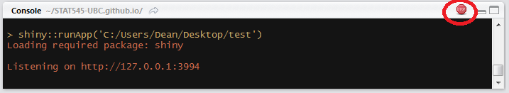

```{r default}
knitr::opts_chunk$set(eval = FALSE, fig.width = 4, fig.height = 4)
```

## 1. Before we begin
You’ll need to have the shiny package, so install it.

```{r}
install.packages("shiny")
```
To ensure you successfully installed Shiny, try running one of the demo apps.

```{r}
library(shiny)
runExample("01_hello")
```

If the example app is running, press Escape to close the app, and you are ready to build your first Shiny app!

Exercise: Visit ShowMeShiny.com, which is a gallery of user-submitted Shiny apps, and click through some of the showcased apps. Get a feel for the wide range of things you can do with Shiny (website under reconstruction).

## 2. Shiny app basics

Every Shiny app is composed of a two parts: a web page that shows the app to the user, and a computer that powers the app. The computer that runs the app can either be your own laptop (such as when you’re running an app from RStudio) or a server somewhere else. You, as the Shiny app developer, need to write these two parts (you’re not going to write a computer, but rather the code that powers the app). In Shiny terminology, they are called UI (user interface) and server.

UI is just a web document that the user gets to see, it’s HTML that you write using Shiny’s functions. The UI is responsible for creating the layout of the app and telling Shiny exactly where things go. The server is responsible for the logic of the app; it’s the set of instructions that tell the web page what to show when the user interacts with the page.

If you look at the app we will be building, the page that you see is built with the UI code. You’ll notice there are some controls that you, as the user, can manipulate. If you adjust the price or choose a country, you’ll notice that the plot and the table get updated. The UI is responsible for creating these controls and telling Shiny where to place the controls and where to place the plot and table, while the server is responsible for creating the actual plot or the data in the table.

## 3. Create an empty Shiny app

All Shiny apps follow the same template:

```{r, eval=FALSE}
library(shiny)
ui <- fluidPage()
server <- function(input, output) {}
shinyApp(ui = ui, server = server)
```

This template is by itself a working minimal Shiny app that doesn’t do much. It initializes an empty UI and an empty server, and runs an app using these empty parts. Copy this template into a new file named app.R in a new folder. A few things you should keep in mind:

* It is **very important** that the name of the file is app.R, otherwise it would not be recognized as a Shiny app.
* You should not have any R code after the shinyApp(ui = ui, server = server) line. That line needs to be the last line in your file.
* It is good practice to place this app in its own folder, and not in a folder that already has other R scripts or files, unless those other files are used by your app.

After saving the file, RStudio should recognize that this is a Shiny app, and you should see the usual Run button at the top change to Run App.'


If you don’t see the Run App button, it means you either have a very old version of RStudio, don’t have Shiny installed, or didn’t follow the file naming conventions.

Click the Run App button, and now your app should run. You won’t see much because it’s an empty app, but you should see that the console has some text printed in the form of `Listening on http://127.0.0.1:5274` and that a little stop sign appeared at the top of the console. You’ll also notice that you can’t run any commands in the console. This is because R is busy–your R session is currently powering a Shiny app and listening for user interaction (which won’t happen because the app has nothing in it yet).

Click the stop button to stop the app, or press the Escape key.



You may have noticed that when you click the Run App button, all it’s doing is just running the function shiny::runApp() in the console. You can run that command instead of clicking the button if you prefer. However, do not place the runApp() function inside the shiny app code!

Exercise: Try running the empty app using the runApp() function instead of using the Run App button.

Note you can add an "auto-reloader" using:
```{r}
# For debugging, allows user to automatically update the app on every save.
options(shiny.autoreload=TRUE)
```

### 3.1 Alternate way to create a Shiny app: separate UI and server files
Another way to define a Shiny app is by separating the UI and server code into two files: ui.R and server.R. This is the preferable way to write Shiny apps when the app is complex and involves more code, but in this tutorial we’ll stick to the simple single file.

If you want to break up your app into these two files, you simply put all code that is assigned to the ui variable in ui.R and all the code assigned to the server function in server.R. When RStudio sees these two files in the same folder, it will know you’re writing a Shiny app. Note that if you use this method (instead of having one app.R file), then you do not need to include the shinyApp(ui = ui, server = server) line.

Exercise: Try making a new Shiny app by creating the two files ui.R and server.R. Remember that they have to be in the same folder. Also remember to put them in a new, isolated folder (not where your app.R already exists).

### 3.2 Let RStudio fill out a Shiny app template for you
You can also create a new Shiny app using RStudio’s menu by selecting File > New File > Shiny Web App…. If you do this, RStudio will let you choose if you want a single-file app (app.R) or a two-file app (ui.R+server.R). RStudio will initialize a simple functional Shiny app with some code in it. I personally don’t use this feature because I find it easier to simply type the few lines of a Shiny app and save the files.

## 4. Load the dataset
The dataset we’ll be using contains information about all the products sold by BC Liquor Store and is provided by OpenDataBC. They provide a direct link to download a csv version of the data, and this data has the rare quality that it is immediately clean and useful. You can view the raw data they provide, but I have taken a few steps to simplify the dataset to make it more useful for our app. I removed some columns, renamed other columns, and dropped a few rare factor levels.

The processed dataset we’ll be using in this app is available here. Download it now and place this file in the same folder as your Shiny app. Make sure the file is named `bcl-data.csv`.

Add a line in your app to load the data into a variable called `bcl`. It should look something like this

```{r}
#filename <- file.path("data", "bcl-data.csv")
#bcl <- read.csv(filename, stringsAsFactors = FALSE)
bcl <- read.csv("https://github.com/UBC-R-Study-group/studyGroup/raw/gh-pages/lessons/20210224/ShinyDemoApp/data/bcl-data.csv", stringsAsFactors = FALSE)
```

Place this line in your app as the second line, just after library(shiny). Make sure the file path and file name are correct, otherwise your app won’t run. Try to run the app to make sure the file can be loaded without errors.

If you want to verify that the app can successfully read the data, you can add a `print()` statement after reading the data. This won’t make anything happen in your Shiny app, but you will see a summary of the dataset printed in the console, which should let you know that the dataset was indeed loaded correctly. You can place the following line after reading the data:

```{r}
print(str(bcl))
```

## 5. Build the basic UI

Let’s start populating our app with some elements visually. This is usually the first thing you do when writing a Shiny app - add elements to the UI.

### 5.1 Add plain text to the UI

You can place R strings inside fluidPage() to render text.
```{r}
fluidPage("BC Liquor Store", "prices")
```
Replace the line in your app that assigns an empty fluidPage() into ui with the one above, and run the app.

The entire UI will be built by passing comma-separated arguments into the fluidPage() function. By passing regular text, the web page will just render boring unformatted text.

## 5.2 Add formatted text and other HTML elements
If we want our text to be formatted nicer, Shiny has many functions that are wrappers around HTML tags that format text. We can use the h1() function for a top-level header (`<h1>` in HTML), `h2()` for a secondary header (`<h2>` in HTML), `strong()` to make text bold (`<strong>` in HTML), `em()` to make text italicized (`<em>` in HTML), and many more.

There are also functions that are wrappers to other HTML tags, such as `br()` for a line break, `img()` for an image, `a()` for a hyperlink, and others.

All of these functions are actually just wrappers to HTML tags with the equivalent name. You can add any arbitrary HTML tag using the tags object, which you can learn more about by reading the help file on tags.

Just as a demonstration, try replacing the fluidPage() function in your UI with

```{r}
fluidPage(
  h1("My app"),
  "BC",
  "Liquor",
  br(),
  "Store",
  strong("prices")
)
```

Run the app with this code as the UI. Notice the formatting of the text and understand why it is rendered that way.

For people who know basic HTML: any named argument you pass to an HTML function becomes an attribute of the HTML element, and any unnamed argument will be a child of the element. That means that you can, for example, create blue text with `div("this is blue", style = "color: blue;")`.

### 5.3 Add a title
We could add a title to the app with `h1()`, but Shiny also has a special function `titlePanel()`. Using `titlePanel()` not only adds a visible big title-like text to the top of the page, but it also sets the “official” title of the web page. This means that when you look at the name of the tab in the browser, you’ll see this title.

Overwrite the `fluidPage()` that you experimented with so far, and replace it with the simple one below, that simply has a title and nothing else.

```{r}
fluidPage(
  titlePanel("BC Liquor Store prices")
)
```

### 5.4 Add a layout
You may have noticed that so far, by just adding text and HTML tags, everything is unstructured and the elements simply stack up one below the other in one column. We’ll use `sidebarLayout()` to add a simple structure. It provides a simple two-column layout with a smaller sidebar and a larger main panel. We’ll build our app such that all the inputs that the user can manipulate will be in the sidebar, and the results will be shown in the main panel on the right.

Add the following code after the `titlePanel()`
```{r}
sidebarLayout(
  sidebarPanel("our inputs will go here"),
  mainPanel("the results will go here")
)
```
Remember that all the arguments inside `fluidPage()` need to be separated by commas.

So far our complete app looks like this (hopefully this isn’t a surprise to you)
```{r summary}
library(shiny)
# filename <- file.path("data", "bcl-data.csv")
# bcl <- read.csv(filename, stringsAsFactors = FALSE)
bcl <- read.csv("https://github.com/UBC-R-Study-group/studyGroup/raw/gh-pages/lessons/20210224/ShinyDemoApp/data/bcl-data.csv", stringsAsFactors = FALSE)

ui <- fluidPage(
  titlePanel("BC Liquor Store prices"),
  sidebarLayout(
    sidebarPanel("our inputs will go here"),
    mainPanel("the results will go here")
  )
)

server <- function(input, output) {}

shinyApp(ui = ui, server = server)
```


### 5.5 All UI functions are simply HTML wrappers
This was already mentioned, but it’s important to remember: the entire UI is just HTML, and Shiny simply gives you easy tools to write it without having to know HTML. To convince yourself of this, look at the output when printing the contents of the ui variable.

```{r}
print(ui)
## <div class="container-fluid">
##   <h2>BC Liquor Store prices</h2>
##   <div class="row">
##     <div class="col-sm-4">
##       <form class="well">our inputs will go here</form>
##     </div>
##     <div class="col-sm-8">the results will go here</div>
##   </div>
## </div>
```

This should make you appreciate Shiny for not making you write horrendous HTML by hand.

## 6. Add inputs to the UI
Inputs are what gives users a way to interact with a Shiny app. Shiny provides many input functions to support many kinds of interactions that the user could have with an app. For example, `textInput()` is used to let the user enter text, `numericInput()` lets the user select a number, `dateInput()` is for selecting a date, `selectInput()` is for creating a select box (aka a dropdown menu).


All input functions have the same first two arguments: `inputId` and `label`. The `inputId` will be the name that Shiny will use to refer to this input when you want to retrieve its current value. It is important to note that every input must have a unique `inputId`. If you give more than one input the same id, Shiny will unfortunately not give you an explicit error, but your app won’t work correctly. The `label` argument specifies the text in the display label that goes along with the input widget. Every input can also have multiple other arguments specific to that input type. The only way to find out what arguments you can use with a specific input function is to look at its help file.

Exercise: Read the documentation of `?numericInput` and try adding a numeric input to the UI. Experiment with the different arguments. Run the app and see how you can interact with this input. Then try different inputs types.

### 6.1 Input for price
The first input we want to have is for specifying a price range (minimum and maximum price). The most sensible types of input for this are either `numericInput()` or `sliderInput()` since they are both used for selecting numbers. If we use `numericInput()`, we’d have to use two inputs, one for the minimum value and one for the maximum. Looking at the documentation for `sliderInput()`, you’ll see that by supplying a vector of length two as the value argument, it can be used to specify a range rather than a single number. This sounds like what we want in this case, so we’ll use `sliderInput()`.

To create a slider input, a maximum value needs to be provided. We could use the maximum price in the dataset, which is 30,250 dollars, but I doubt I’d ever buy something that expensive. I think 100 dollars is a more reasonable max price for me, and about 85% of the products in this dataset are below 100 dollars, so let’s use that as our max.

By looking at the documentation for the slider input function, the following piece of code can be constructed.
```{r}
sliderInput("priceInput", "Price", min = 0, max = 100,
            value = c(25, 40), pre = "$")
```

Place the code for the slider input inside `sidebarPanel()` (replace the text we wrote earlier with this input).

### 6.2 Input for product type
Usually when going to the liquor store you know whether you’re looking for beer or wine, and you don’t want to waste your time in the wrong section. The same is true in our app, we should be able to choose what type of product we want.

For this we want some kind of a text input. But allowing the user to enter text freely isn’t the right solution because we want to restrict the user to only a few choices. We could either use radio buttons or a select box for our purpose. Let’s use radio buttons for now since there are only a few options, so take a look at the documentation for `radioButtons()` and come up with a reasonable input function code. It should look like this:

```{r}
radioButtons("typeInput", "Product type",
            choices = c("BEER", "REFRESHMENT", "SPIRITS", "WINE"),
            selected = "WINE")
```
Add this input code inside `sidebarPanel()`, after the previous input (separate them with a comma).

### 6.3 Input for country
Sometimes I like to feel fancy and only look for wines imported from France. We should add one last input, to select a country. The most appropriate input type in this case is probably the select box. Look at the documentation for `selectInput() `and create an input function. For now let’s only have CANADA, FRANCE, ITALY as options, and later we’ll see how to include all countries.

```{r}
selectInput("countryInput", "Country",
            choices = c("CANADA", "FRANCE", "ITALY"))
```

Add this function as well to your app. If you followed along, your entire app should have this code:

```{r}
library(shiny)
# filename <- file.path("data", "bcl-data.csv")
# bcl <- read.csv(filename, stringsAsFactors = FALSE)
bcl <- read.csv("https://github.com/UBC-R-Study-group/studyGroup/raw/gh-pages/lessons/20210224/ShinyDemoApp/data/bcl-data.csv", stringsAsFactors = FALSE)

ui <- fluidPage(
  titlePanel("BC Liquor Store prices"),
  sidebarLayout(
    sidebarPanel(
      sliderInput("priceInput", "Price", 0, 100, c(25, 40), pre = "$"),
      radioButtons("typeInput", "Product type",
                  choices = c("BEER", "REFRESHMENT", "SPIRITS", "WINE"),
                  selected = "WINE"),
      selectInput("countryInput", "Country",
                  choices = c("CANADA", "FRANCE", "ITALY"))
    ),
    mainPanel("the results will go here")
  )
)

server <- function(input, output) {}

shinyApp(ui = ui, server = server)
```


## 7. Add placeholders for outputs
After creating all the inputs, we should add elements to the UI to display the outputs. Outputs can be any object that R creates and that we want to display in our app - such as a plot, a table, or text. We’re still only building the UI, so at this point we can only add placeholders for the outputs that will determine where an output will be and what its ID is, but it won’t actually show anything. Each output needs to be constructed in the server code later.

Shiny provides several output functions, one for each type of output. Similarly to the input functions, all the ouput functions have a outputId argument that is used to identify each output, and this argument must be unique for each output.

### 7.1 Output for a plot of the results
At the top of the main panel we’ll have a plot showing some visualization of the results. Since we want a plot, the function we use is `plotOutput()`.

Add the following code into the `mainPanel()` (replace the existing text):

```{r}
plotOutput("coolplot")
```
This will add a placeholder in the UI for a plot named coolplot.

Exercise: To remind yourself that we are still merely constructing HTML and not creating actual plots yet, run the above `plotOutput()` function in the console to see that all it does is create some HTML.

### 7.2 Output for a table summary of the results
Below the plot, we will have a table that shows all the results. To get a table, we use the `tableOutput()` function.

Here is a simple way to create a UI element that will hold a table output:
```{r}
tableOutput("results")
```

Add this output to the `mainPanel()` as well. Maybe add a couple `br()` in between the two outputs, just as a space buffer so that they aren’t too close to each other.

## 8. Checkpoint: what our app looks like after implementing the UI
If you’ve followed along, your app should now have this code:

```{r}
library(shiny)
# filename <- file.path("data", "bcl-data.csv")
# bcl <- read.csv(filename, stringsAsFactors = FALSE)
bcl <- read.csv("https://github.com/UBC-R-Study-group/studyGroup/raw/gh-pages/lessons/20210224/ShinyDemoApp/data/bcl-data.csv", stringsAsFactors = FALSE)

ui <- fluidPage(
  titlePanel("BC Liquor Store prices"),
  sidebarLayout(
    sidebarPanel(
      sliderInput("priceInput", "Price", 0, 100, c(25, 40), pre = "$"),
      radioButtons("typeInput", "Product type",
                  choices = c("BEER", "REFRESHMENT", "SPIRITS", "WINE"),
                  selected = "WINE"),
      selectInput("countryInput", "Country",
                  choices = c("CANADA", "FRANCE", "ITALY"))
    ),
    mainPanel(
      plotOutput("coolplot"),
      br(), br(),
      tableOutput("results")
    )
  )
)

server <- function(input, output) {}

shinyApp(ui = ui, server = server)
```

## 9. Implement server logic to create outputs
So far we only wrote code inside that was assigned to the ui variable (or code that was written in ui.R). That’s usually the easier part of a Shiny app. Now we have to write the server function, which will be responsible for listening to changes to the inputs and creating outputs to show in the app.

If you look at the server function, you’ll notice that it is always defined with two arguments: input and output. You must define these two arguments! Both input and output are list-like objects. As the names suggest, input is a list you will read values from and output is a list you will write values to. input will contain the values of all the different inputs at any given time, and output is where you will save output objects (such as tables and plots) to display in your app.

### 9.1 Building an output
Recall that we created two output placeholders: coolplot (a plot) and results (a table). We need to write code in R that will tell Shiny what kind of plot or table to display. There are three rules to build an output in Shiny.

Save the output object into the output list (remember the app template - every server function has an output argument)
Build the object with a render* function, where * is the type of output
Access input values using the input list (every server function has an input argument)
The third rule is only required if you want your output to depend on some input, so let’s first see how to build a very basic output using only the first two rules. We’ll create a plot and send it to the coolplot output.

```{r}
output$coolplot <- renderPlot({
  plot(rnorm(100))
})
```

This simple code shows the first two rules: we’re creating a plot inside the `renderPlot()` function, and assigning it to coolplot in the output list. Remember that every output created in the UI must have a unique ID, now we see why. In order to attach an R object to an output with ID x, we assign the R object to output$x.

Since coolplot was defined as a `plotOutput`, we must use the `renderPlot` function, and we must create a plot inside the `renderPlot` function.

If you add the code above inside the server function, you should see a plot with 100 random points in the app.

### 9.2 Making an output react to an input
Now we’ll take the plot one step further. Instead of always plotting the same plot (100 random numbers), let’s use the minimum price selected as the number of points to show. It doesn’t make too much sense, but it’s just to learn how to make an output depend on an input.
```{r}
output$coolplot <- renderPlot({
  plot(rnorm(input$priceInput[1]))
})
```

Replace the previous code in your server function with this code, and run the app. Whenever you choose a new minimum price range, the plot will update with a new number of points. Notice that the only thing different in the code is that instead of using the number 100 we are using `input$priceInput[1]`.

What does this mean? Just like the variable output contains a list of all the outputs (and we need to assign code into them), the variable input contains a list of all the inputs that are defined in the UI. `input$priceInput` return a vector of length 2 containing the miminimum and maximum price. Whenever the user manipulates the slider in the app, these values are updated, and whatever code relies on it gets re-evaluated. This is a concept known as reactivity, which we will get to in a few minutes.

Notice that these short 3 lines of code are using all the 3 rules for building outputs: we are saving to the output list (`output$coolplot <-`), we are using a `render*` function to build the output (`renderPlot({})`), and we are accessing an input value (`input$priceInput[1]`).

### 9.3 Building the plot output
Now we have all the knowledge required to build a plot visualizing some aspect of the data. We’ll create a simple histogram of the alcohol content of the products by using the same 3 rules to create a plot output.

First we need to make sure ggplot2 is loaded, so add a `library(ggplot2)` at the top.

Next we’ll return a histogram of alcohol content from `renderPlot()`. Let’s start with just a histogram of the whole data, unfiltered.
```{r}
output$coolplot <- renderPlot({
  ggplot(bcl, aes(Alcohol_Content)) +
    geom_histogram()
})
```

If you run the app with this code inside your server, you should see a histogram in the app. But if you change the input values, nothing happens yet, so the next step is to actually filter the dataset based on the inputs.

Recall that we have 3 inputs: `priceInput`, `typeInput`, and `countryInput.` We can filter the data based on the values of these three inputs. We’ll use `dplyr` functions to filter the data, so be sure to include `dplyr` at the top. Then we’ll plot the filtered data instead of the original data.

```{r}
output$coolplot <- renderPlot({
  filtered <-
    bcl %>%
    filter(Price >= input$priceInput[1],
           Price <= input$priceInput[2],
           Type == input$typeInput,
           Country == input$countryInput
    )
  ggplot(filtered, aes(Alcohol_Content)) +
    geom_histogram()
})
```

Place this code in your server function and run the app. If you change any input, you should see the histogram update. The way I know the histogram is correct is by noticing that the alcohol content is about 5% when I select beer, 40% for spirits, and 13% for wine. That sounds right.

Read this code and understand it. You’ve successfully created an interactive app - the plot is changing according to the user’s selection.

To make sure we’re on the same page, here is what your code should look like at this point:

```{r}
library(shiny)
library(ggplot2)
library(dplyr)

# filename <- file.path("data", "bcl-data.csv")
# bcl <- read.csv(filename, stringsAsFactors = FALSE)
bcl <- read.csv("https://github.com/UBC-R-Study-group/studyGroup/raw/gh-pages/lessons/20210224/ShinyDemoApp/data/bcl-data.csv", stringsAsFactors = FALSE)

ui <- fluidPage(
  titlePanel("BC Liquor Store prices"),
  sidebarLayout(
    sidebarPanel(
      sliderInput("priceInput", "Price", 0, 100, c(25, 40), pre = "$"),
      radioButtons("typeInput", "Product type",
                  choices = c("BEER", "REFRESHMENT", "SPIRITS", "WINE"),
                  selected = "WINE"),
      selectInput("countryInput", "Country",
                  choices = c("CANADA", "FRANCE", "ITALY"))
    ),
    mainPanel(
      plotOutput("coolplot"),
      br(), br(),
      tableOutput("results")
    )
  )
)

server <- function(input, output) {
  output$coolplot <- renderPlot({
    filtered <-
      bcl %>%
      filter(Price >= input$priceInput[1],
             Price <= input$priceInput[2],
             Type == input$typeInput,
             Country == input$countryInput
      )
    ggplot(filtered, aes(Alcohol_Content)) +
      geom_histogram()
  })
}

shinyApp(ui = ui, server = server)
```


# Below is for if time permits

## 10. Reactivity 101
Shiny uses a concept called reactive programming. This is what enables your outputs to react to changes in inputs. Reactivity in Shiny is complex, but as an extreme oversimplification, it means that when the value of a variable x changes, then anything that relies on x gets re-evaluated. Notice how this is very different from what you are used to in R. Consider the following code:
```{r}
x <- 5
y <- x + 1
x <- 10
```

What is the value of y? It’s 6. But in reactive programming, if x and y are reactive variables, then the value of y would be 11 because it would be updated whenever x is changed. This is a very powerful technique that is very useful for creating the responsiveness of Shiny apps, but it might be a bit weird at first because it’s a very different concept from what you’re used to.

Only reactive variables behave this way, and in Shiny all inputs are automatically reactive. That’s why you can always use input$x in render functions, and you can be sure that whatever output depends on x will use the updated value of x whenever x changes.

You might be wondering what it means to “depend” on a variable. This is not the official terminology, but it simply means that the variable is referenced in the code. So by merely accessing the value of a reactive variable, it causes the current code block to “depend” on that variable. Consider the following sample code to create a plot with a specific number of points in a specific colour:

```{r}
output$someoutput <- renderPlot({
  col <- input$mycolour
  num <- input$mynumber
  plot(rnorm(num), col = col)
})
```

The above render function accesses two different inputs: input$mycolour and input$mynumber. This means that this code block depends on both of these variables, so whenever either one of the two inputs is updated, the code gets re-executed with the new input values and output$someoutput is updated.

### 10.1 Creating and accessing reactive variables
One very important thing to remember about reactive variables (such as the input list) is that they can only be used inside reactive contexts. Any render* function is a reactive context, so you can always use input$x or any other reactive variable inside render functions. There are two other common reactive contexts that we’ll get to in a minute: reactive({}) and observe({}). To show you what this means, let’s try accessing the price input value in the server function, without explicitly being inside a reactive context. Simply add print(input$priceInput) inside the server function, and you will get an error when running the app:

Operation not allowed without an active reactive context. (You tried to do something that can only be done from inside a reactive expression or observer.)
Shiny is very clear about what the error is: we are trying to access a reactive variable outside of a reactive context. To fix this, we can use the observe({}) function to access the input variable. Inside the server, replace print(input$priceInput) with observe({ print(input$priceInput) }), and now the app should run fine. Note that this observe({}) statement depends on input$priceInput, so whenever you change the value of the price, the code inside this observe({}) will run again, and the new value will be printed. This is actually a very simple yet useful debugging technique in Shiny: often you want to know what value a reactive variable holds, so you need to remember to wrap the cat(input$x) or print(input$x) by an observe({}).

So far we only saw one reactive variable: the input list. You can also create your own reactive variables using the reactive({}) function. The reactive({}) function is similar to observe({}) in that it is also a reactive context, which means that it will get re-run whenever any of the reactive variables in it get updated. The difference between them is that reactive({}) returns a value. To see it in action, let’s create a variable called priceDiff that will be the difference between the maximum and minimum price selected. If you try to naively define priceDiff <- diff(input$priceInput), you’ll see the same error as before about doing something outside a reactive context. This is because input$priceInput is a reactive variable, and we can’t use a reactive variable outside a reactive context. Since we want to assign a value, we use the reactive({}) function. Try adding the following line to your server:

```{r}
priceDiff <- reactive({
  diff(input$priceInput)
})
```

Now your app will run. If you want to access a reactive variable defined with reactive({}), you must add parentheses after the variable name, as if it’s a function. To demonstrate this, add observe({ print(priceDiff()) }) to your server function. Notice that we use priceDiff() rather than priceDiff. It’s very important to remember this, because you can get confusing unclear errors if you simply try to access a custom reactive variable without the parentheses.

You can think of reactivity as causing a chain reaction: when one reactive value changes, anything that depends on it will get updated. If any of the updated values are themselves reactive variables, then any reactive contexts that depend on those variables will also get updated in turn. As a concrete example, let’s think about what happens when you change the value of the priceInput on the page. Since input$priceInput is a reactive variable, any expression that uses it will get updated. This means the two render functions from earlier will execute because they both depend on input$priceInput, as well as the priceDiff variable because it also depends on it. But since priceDiff is itself a reactive variable, Shiny will check if there is anything that depends on priceDiff, and indeed there is - the observe({}) function that prints the value of priceDiff. So once priceDiff gets updated, the observe({}) function will run, and the value will get printed.

Reactivity is usually the hardest part about Shiny to understand, so if you don’t quite get it, don’t feel bad. Try reading this section again, and I promise that with time and experience you will get more comfortable with reactivity. Once you do feel more confident with reactivity, it may be a good idea to read more advanced documentation describing reactivity, since this section greatly simplifies ideas to make them more understandable. A great resource is RStudio’s tutorial on reactivity.

Before continuing to the next section, you can remove all the observe({}) and reactive({}) functions we wrote in this section since they were all just for learning purposes.

Exercise: Read this section again and really understand what a reactive variable means, what the 3 main reactive contexts are, how you can define reactive variables, and how a reactivity chain of events works.

### 10.2 Using reactive variables to reduce code duplication
You may have noticed that we have the exact same code filtering the dataset in two places, once in each render function. We can solve that problem by defining a reactive variable that will hold the filtered dataset, and use that variable in the render functions.

The first step would be to create the reactive variable. The following code should be added to the server function.
```{r}
filtered <- reactive({
  bcl %>%
    filter(Price >= input$priceInput[1],
           Price <= input$priceInput[2],
           Type == input$typeInput,
           Country == input$countryInput
    )
})
```

The variable filtered is being defined exactly like before, except the body is wrapped by a reactive({}), and it’s defined in the server function instead of inside the individual render functions. Now that we have our reactive variable, we can use it in the output render functions. Try it yourself, and when you think you’re done, check the code below. Don’t forget that in order to access the value of a reactive expression, you must follow the name of the variable with parentheses! This is how your server function should look like now.

```{r}
server <- function(input, output) {
  filtered <- reactive({
    bcl %>%
      filter(Price >= input$priceInput[1],
             Price <= input$priceInput[2],
             Type == input$typeInput,
             Country == input$countryInput
      )
  })
  
  output$coolplot <- renderPlot({
    ggplot(filtered(), aes(Alcohol_Content)) +
      geom_histogram()
  })

  output$results <- renderTable({
    filtered()
  })
}
```

As a reminder, Shiny creates a dependency tree with all the reactive expressions to know what value depends on what other value. For example, when the price input changes, Shiny looks at what values depend on price, and sees that filtered is a reactive expression that depends on the price input, so it re-evaluates filtered. Then, because filtered is changed, Shiny now looks to see what expressions depend on filtered, and it finds that the two render functions use filtered. So Shiny re-executes the two render functions as well.

## 11. Using uiOutput() to create UI elements dynamically
One of the output functions you can add in the UI is uiOutput(). According to the naming convention (eg. plotOutput() is an output to render a plot), this is an output used to render more UI. This may sound a bit confusing, but it’s actually very useful. It’s usually used to create inputs (or any other UI) from the server, or in other words - you can create inputs dynamically.

Any input that you normally create in the UI is created when the app starts, and it cannot be changed. But what if one of your inputs depends on another input? In that case, you want to be able to create an input dynamically, in the server, and you would use uiOutput(). uiOutput() can be used to create any UI element, but it’s most often used to create input UI elements. The same rules regarding building outputs apply, which means the output (which is a UI element in this case) is created with the function renderUI().

### 11.1 Basic example of uiOutput()
As a very basic example, consider this app:
```{r}
library(shiny)
ui <- fluidPage(
  numericInput("num", "Maximum slider value", 5),
  uiOutput("slider")
)

server <- function(input, output) {
  output$slider <- renderUI({
    sliderInput("slider", "Slider", min = 0,
                max = input$num, value = 0)
  })
}

shinyApp(ui = ui, server = server)
```
If you run that tiny app, you will see that whenever you change the value of the numeric input, the slider input is re-generated. This behaviour can come in handy often.

### 11.2 Use uiOutput() in our app to populate the countries
We can use this concept in our app to populate the choices for the country selector. The country selector currently only holds 3 values that we manually entered, but instead we could render the country selector in the server and use the data to determine what countries it can have.

First we need to replace the selectInput("countryInput", ...) in the UI with
```{r}
uiOutput("countryOutput")
```
Then we need to create the output (which will create a UI element - yeah, it can be a bit confusing at first), so add the following code to the server function:

```{r}
output$countryOutput <- renderUI({
  selectInput("countryInput", "Country",
              sort(unique(bcl$Country)),
              selected = "CANADA")
})
```

Now if you run the app, you should be able to see all the countries that BC Liquor stores import from.

### 11.3 Errors showing up and quickly disappearing
You might notice that when you first run the app, each of the two outputs are throwing an error message, but the error message goes away after a second. The problem is that when the app initializes, filtered is trying to access the country input, but the country input hasn’t been created yet. After Shiny finishes loading fully and the country input is generated, filtered tries accessing it again, this time it’s successful, and the error goes away.

Once we understand why the error is happening, fixing it is simple. Inside the filtered reactive function, we should check if the country input exists, and if not then just return NULL.
```{r}
filtered <- reactive({
  if (is.null(input$countryInput)) {
    return(NULL)
  }    
  
  bcl %>%
    filter(Price >= input$priceInput[1],
           Price <= input$priceInput[2],
           Type == input$typeInput,
           Country == input$countryInput
    )
})
```
Now when the render function tries to access the data, they will get a NULL value before the app is fully loaded. You will still get an error, because the ggplot function will not work with a NULL dataset, so we also need to make a similar check in the renderPlot() function. Only once the data is loaded, we can try to plot.

```{r}
output$coolplot <- renderPlot({
  if (is.null(filtered())) {
    return()
  }
  ggplot(filtered(), aes(Alcohol_Content)) +
    geom_histogram()
})
```
The renderTable() function doesn’t need this fix applied because Shiny doesn’t have a problem rendering a NULL table.

Exercise: Change the product type radio buttons to get generated in the server with the values from the dataset, instead of being created in the UI with the values entered manually. If you’re feeling confident, try adding an input for “subtype” that will get re-generated every time a new type is chosen, and will be populated with all the subtype options available for the currently selected type (for example, if WINE is selected, then the subtype are white wine, red wine, etc.).

## 12. Final Shiny app code
In case you got lost somewhere, here is the final code. The app is now functional, but there are plenty of features you can add to make it better.

```{r}
library(shiny)
library(ggplot2)
library(dplyr)

# bcl <- read.csv("bcl-data.csv", stringsAsFactors = FALSE)
bcl <- read.csv("https://github.com/UBC-R-Study-group/studyGroup/raw/gh-pages/lessons/20210224/ShinyDemoApp/data/bcl-data.csv", stringsAsFactors = FALSE)

ui <- fluidPage(
  titlePanel("BC Liquor Store prices"),
  sidebarLayout(
    sidebarPanel(
      sliderInput("priceInput", "Price", 0, 100, c(25, 40), pre = "$"),
      radioButtons("typeInput", "Product type",
                  choices = c("BEER", "REFRESHMENT", "SPIRITS", "WINE"),
                  selected = "WINE"),
      uiOutput("countryOutput")
    ),
    mainPanel(
      plotOutput("coolplot"),
      br(), br(),
      tableOutput("results")
    )
  )
)

server <- function(input, output) {
  output$countryOutput <- renderUI({
    selectInput("countryInput", "Country",
                sort(unique(bcl$Country)),
                selected = "CANADA")
  })  
  
  filtered <- reactive({
    if (is.null(input$countryInput)) {
      return(NULL)
    }    
    
    bcl %>%
      filter(Price >= input$priceInput[1],
             Price <= input$priceInput[2],
             Type == input$typeInput,
             Country == input$countryInput
      )
  })
  
  output$coolplot <- renderPlot({
    if (is.null(filtered())) {
      return()
    }
    ggplot(filtered(), aes(Alcohol_Content)) +
      geom_histogram()
  })

  output$results <- renderTable({
    filtered()
  })
}

shinyApp(ui = ui, server = server)
```
