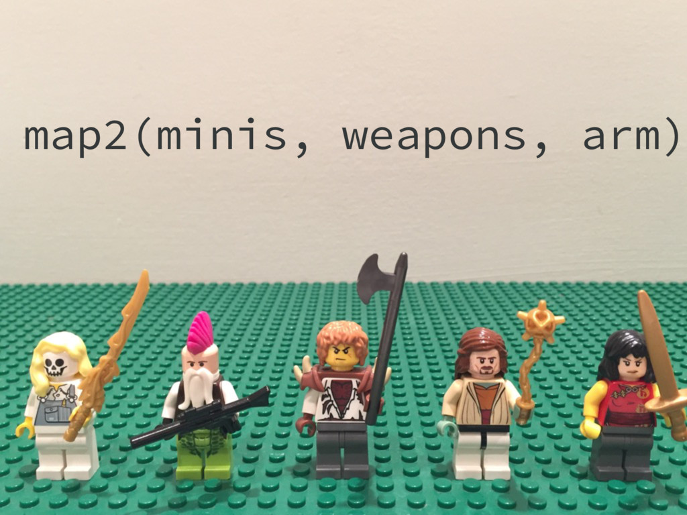

```{r setup, include=FALSE}
knitr::opts_chunk$set(
  echo = TRUE, 
  comment = ""
)
```


## Setup
First, we need to load the tidyverse, which also attaches purrr. Then, we need
to set up some practice data to use later in our examples.
```{r message = FALSE}
library(tidyverse)

practice_list <- list(a = 9, b = 16, c = 25)

simple_list_num <- list("first" = 1, "second" = 2, "third" = 3)
simple_list_name <- list("first", "second", "third")

# Load in gene data
treatment1 <- read_csv(
  "https://raw.githubusercontent.com/UBC-R-Study-group/studyGroup/gh-pages/lessons/20191113/genes_treatment1_vs_ctrl.csv"
)

treatment2 <- read_csv(
  "https://raw.githubusercontent.com/UBC-R-Study-group/studyGroup/gh-pages/lessons/20191113/genes_treatment2_vs_ctrl.csv"
)
```


## Getting started
Lists are a versatile and common data type in R. You've likely encountered them
already, but let's go through a few basics on lists. 

Lists are similar to atomic vectors in R, but they can store different data
types (e.g. numeric and character), and the elements within them can be of
varying length. Like vectors, lists can also have names for each element within. 

First, let's go over a few ways to access elements within lists.  

There are a few main ways to do this: `[`, ``[[``, and `$`. Let's see how these
methods differ, remembering to pay special attention to the class of object
returned, as this can be important when performing more complex operations with
lists.
```{r}
practice_list

# Getting the names given to items in the list
names(practice_list)


# Accessing specific items via index
# Notice the type of object returned here
practice_list[1]
class(practice_list[1])


# Compared to the type of object returned here
practice_list[[1]]
class(practice_list[[1]])


# Using name with "$" is like using [[ ]]
practice_list$a
class(practice_list$a)
```


## Iterating with a `for` loop
So how do we go about iterating, or repeating an action, on our list? Let's
begin with the most common method, a `for` loop, which comes up in many
languages outside of R as well.
```{r}
# Simplest notation
for (i in practice_list) {
  print(i * 2)
}

# More complex, but will prove more useful later
for (i in 1:length(practice_list)) {
  print("Starting loop...")
  print(i)
  print(practice_list[[i]])
  print(practice_list[[i]] * 2)
}
```

Cool! Notice though that the output of the above only goes to the console. To
save the output like above, we need to assign each output to an element in a new
list. Play close attention to where the output list is created; if it was done
inside the `for` loop, the list would be reset each time!!
```{r}
# List needs to be created outside the for loop
output_list <- list()

for (i in 1:length(practice_list)) {
  output_list[i] <- sqrt(practice_list[[i]])
}
output_list
names(output_list)
```

Notice that we lost the names from our original list, since the output is being
pushed to a new object. Let's add the names back to our new list:
```{r}
names(output_list) <- names(practice_list)
names(output_list)
```

## Iterating with purrr's `map()` function
Now that we've covered some basic iteration with `for`, let's move right along
and talk about the purrr method. The function we'll start with, `map()`, takes
as input a list and a function. It executes the specified function on each
element of the input list, and returns as it's output a new list. So it works
just like a `for` loop, but it's designed to be easier to write and use, and
much more powerful (not to mention it's faster too!).

So how we can rewrite the above, making use of the map() function? There are
actually a few different ways as we'll see below.
```{r}
map(.x = practice_list, .f = sqrt)

map(practice_list, function(x) {
  sqrt(x)
})

# Include use of pipes and shorthand function notation (formulas)
practice_list %>% map(~sqrt(.x))
```

Notice here that our list names are kept in the new object. Neat!


## Applying functions to lists of data frames
While the examples above have hopefully been instructive, they may not be 
similar to what many people are accustomed to working with in R. Let's see how
we can build a list of data frames, and use map to apply common dplyr verbs such
as filter, select, and mutate to multiple data frames at a time.

Let's start by building our list and taking a quick look at our data.
```{r}
gene_list <- list(
  "treatment1" = treatment1,
  "treatment2" = treatment2
)

# Again, using `$` allows us to access the list contents by name
gene_list$treatment1 %>% glimpse()

# Now let's apply a select and filter call to our data frames
gene_list_2 <- gene_list %>% map(
  ~select(.x, gene_id, log2FoldChange, padj) %>% 
    filter(padj < 0.001, abs(log2FoldChange) > log2(2))
)
glimpse(gene_list_2)
```

<br>

What if we wanted to combine the above two data frames into one? Say, if we
wanted to make a plot of the genes and the fold changes for the two treatments.
We can accomplish this using the function `bind_rows()`. It takes a list of data
frames as input, and merges them by simply appending the data frames together.
Note that this means all the data frames need to have the same columns.  
The only other argument for bind_rows is `.id`. This argument will be used to
create/name a column in each data frame, which will be populated with that data
frame's list name. This makes it easy to tell  which row came from which element
in our original list. Let's see it in action!
```{r}
glimpse(
  combined_df <- bind_rows(gene_list_2, .id = "treatment")
)
```


And, we can actually undo the above using the base R `split` function:
```{r}
# x represents the vector (or in this case data frame) while f is the groups,
# or the column on which we wish to split our data frame
glimpse(
  split(x = combined_df, f = combined_df$treatment)
)
```


## Transforming a named list to a data frame
While lists are great, and allow for some really powerful programming, sometimes
we still want to work with data frames. How can we go about converting lists 
into data frames? What about the other way around? The first case is covered 
by the `enframe` function from the tibble package. Let's see an example:
```{r}
enframe(practice_list)
```

Hmm, it sort of worked, but the value column seems a little off. As it turns 
out, enframe returns the value column as a nested list, when a list (not a named
vector) is the input. We can easily remedy this with the following:
```{r}
enframe(practice_list) %>% mutate(value = as.numeric(value))
```

The opposite of this can be accomplished with `deframe`, which converts a
two-column data frame into a named list.


## Parallel mapping with `map2()`
What if we have two lists, where the first element of the first list "matches" 
or corresponds with the first element of the second list, and so on. How could
we using map to work through these lists in parallel? Fortunately we can do so
easily with `map2()`!

<br>

In the above, we have a list of minis, and a list of weapons, one for each. We
use map2 to apply the `arm` function, giving each mini their corresponding
weapon.

Let's see this in action with an example:
```{r}
simple_list_name
simple_list_num

map2(
  simple_list_name, 
  simple_list_num,
  ~paste0("The ", .x, " number is: ", .y)
)
```

In situations where we want to use the contents and names of a list in map2
(like above), we can actually shorthand this using `imap` (think indexed map)
function:
```{r}
imap(
  simple_list_num,
  ~paste0("The ", .y, " number is: ", .x)
)
```
In the above, the contents of the list (1, 2, 3) are referred to as `.x`, while
the names of the list become `.y`.

Aside: What you have more than two parallel lists? In this case, you can use
pmap(), which functions just like map2 but allows you to step through any number
of lists - each is denoted like `..1`, `..2`, `..3`, etc.

<br>
