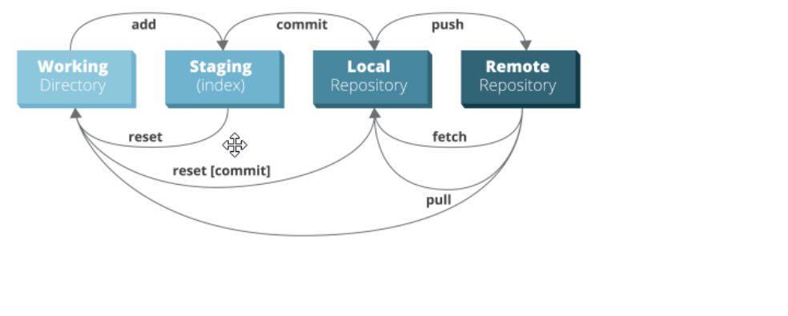
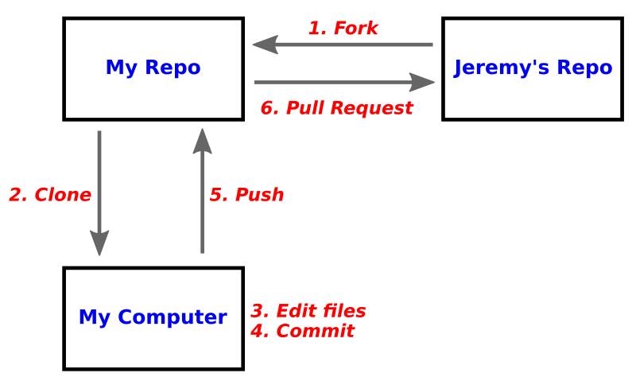
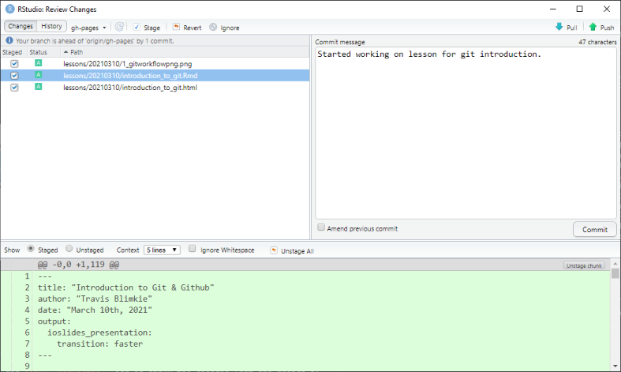
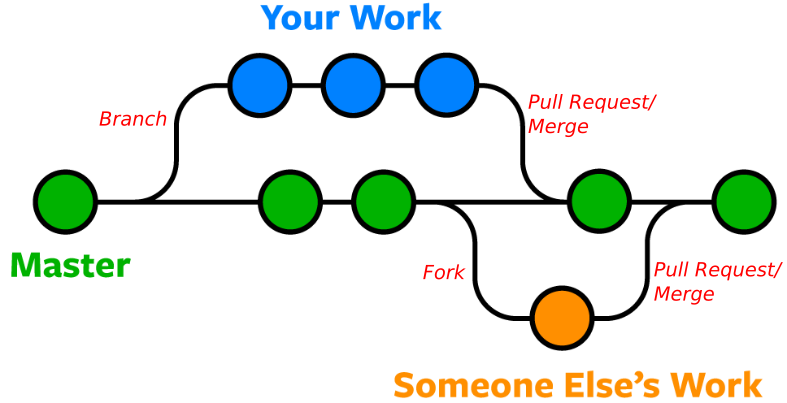

# Introduction to Git & Github

Travis Blimkie
March 10th, 2021

## Before we get started

This lesson was inspired by the "What they forgot to teach you about R" seminar,
originally presented by Jenny Byran, Jim Hester, and Alison Hill. Here's a link
to the original material: https://rstats.wtf/

Today we will cover some basics of git (background/theory); next week we'll dive
into some examples on using git/Github with RStudio.

## Overview for today

- What is git?
  - What's the difference between git and Github?
- Benefits of using git
- Basic git commands
- Git workflow
- Other git commands
- Git and RStudio
- Branches

## What is git?

- Git is a program/language that is designed to facilitate version
control
- We can keep track of changes we make to files, and provide messages whenever
we change things
- Reverting changes, or tracking down why certain changes were made is much
easier than manually attempting this
- It can actually be used completely offline to manage projects 
- Once we go online, git allows us to collaborate with others and simultaneously
contribute to a project

Side note: there are other version control programs that accomplish the same
thing as git, such as Subversion and Mercurial.

## Git vs. Github

- Github is a specific website/service that allows us to host projects online,
and collaborate with others
- You can start a project locally, and use git to interact with the online
version of the project on Github
- Adds some extra functionality to make sharing and collaborating on code even
easier, like issues, projects, Github pages, etc.

Side note: There are also other services like Github, such as Bitbucket and
Gitlab.

## Why should I use git?

- Version control means we can see how/why our code changes over time
- Makes sharing and contributing to code easier
- Because it serves as an "automatic backup", we're free to experiment without
fear of impacting functional code
- Encourages incremental work - small changes that add up over time
- Exposes your work to the open source world

## Primary git commands

- STATUS - See if/how your local version of the repository has changed
(diverged) from the online copy
- ADD - after changing a file, you add or stage it to the next commit
- COMMIT - "commit" to making the added change, and provide a message to explain
what changed and why
- PUSH - Send those committed changes to the remote copy of the project (i.e. on
Github)
- PULL - Apply changes on the remote repository to your own local copy (i.e.
changes made by a collaborator on their machine)

## Example workflow

- Edit a file -  you found and fixed a type in the main script
- `git status` to see what files have changed
- `git pull` if you're local version is behind the online version
- `git add script.R` to stage the affected file
- `git commit -m "Fixed a typo"` to commit the change with a message
- `git push` to send your committed changes to Github

## Git workflow visualized

## Other important git commands

- `clone` - Download a repository from Github to your local machine
- `diff some.file` - See how a file has been changed
- `fork` - Create a copy (branch) of someone else's repository
- `branch` - Create a separate (but related) copy of your own repository - more
on this in a minute
- `merge` and **pull request** - add or apply the changes from one branch of
fork into another

## Aside on git status and fetch

- When you run `status`, your local working directory is compared against a
local file, which represents the state of the remote repository (i.e. Github)
- If you make a change on Github directly, then run `status` on your local
machine, it will report that you're up-to-date, even though you know you're
behind
- This is because the local representative file hasn't been updated by the
status command
- Here is where you need to run `fetch`, to update the local representation of
the remote, followed by `status` to see that you're behind by one commit

## Git fetch and status (continued)

So to check if you're behind the remote:

- `git fetch`
- `git status`
- `git pull` if necessary

Important to do this BEFORE you start making local changes

## Expanded git workflow

## Workflow for git + RStudio

- Create the new project on Github
- New project in RStudio via `clone` option
- Make some changes
- Add, commit, push & repeat!

RStudio includes some great integration for working with git, providing GUI 
access to all most of the previously mentioned git commands (or at least the
most common ones).

## Preview of RStudio's git pane

## Branches

- Branches provide a means of creating a separate copy of a repository, that is
still linked to the original version
- Changes can be made on the new branch without impacting the original
- These changes can then be merged into the new branch all at once
- Great for keeping a working/stable version of code while also facilitating 
experimentation
- E.g. stable and development versions of packages or projects one common
example
- Production and testing as another

## Visualizing branches

## Using branches

- Branches are the key to collaboration in git
- Allow different people to simultaneously work on the same project
- Branches can be created to implement new features, without impacting the main
version 
- Forking a repository can allow you or anyone else to contribute to large, 
open source projects
- E.g. [RStudio!](https://github.com/rstudio/rstudio)

## Homework for next week

- Set up a [Github account](https://github.com/join)
- Ensure git is installed on your computer
- For Windows: [Install git for Windows](https://git-scm.com/download/win)
- For Mac: [Install git for Mac](https://git-scm.com/download/mac)
