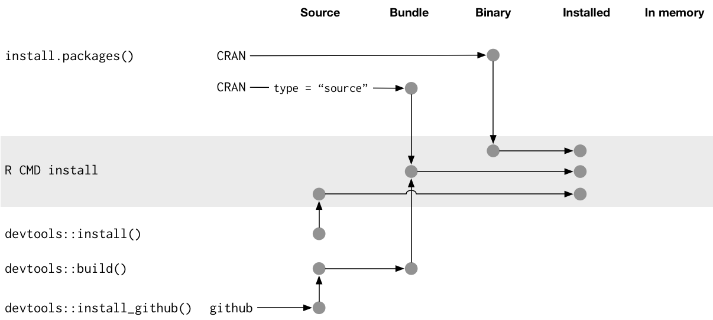

```{r setup, include=FALSE}
knitr::opts_chunk$set(
  include = TRUE,
  warning = FALSE,
  message = FALSE,
  comment = ""
)
library(tidyverse)
```

Make sure that we install all the dependencies!
```{r}
install.packages(c("devtools", "roxygen2", "testthat", "knitr"))
library(devtools)
library(roxygen2)
library(testthat)
library(knitr)
```

## Outline
- What are packages?
- Writing your own package
- The components of a package 
- Note that we will not be covering object oriented programming.

## Why Packages?
- Reduce the amount of copy & pasting required
    - Reduces the chances of making a mistake
- Help tackle a novel problem that others are interested in too
- CRAN brownie points

## Package States


Briefly, packages can exist in different states. "Source" is the source code of the package (what we'll be working with today), "bundle" is a compressed .tar.gz file with all of the source content in it. "binary" are .tgz or .zip files and a way to distribute our package to an R user who doesn’t have package development tools. When you call `install.packages()`, you are downloading the binary. Installed packages are packages that have been decompressed into package libraries. You can look at your libraries by running:

```{r}
lapply(.libPaths(), list.dirs, recursive = FALSE, full.names = FALSE)
```

Finally, we can think of "in-memory" packages a just packages that you have "loaded" into a session. 

## Functions
- You have used functions in the past like `sum()`, `mean()`, `filter()`
- Under the hood these are powered by lines of R code
- To view documentation of a function - you can type in `?function_name()` in your console.
- To view the source of a function - you can type in the `function_name` in your console.

```{r create_package_workflow, eval = FALSE}
# Create package
# usethis::create_package("/Users/owner/Documents/UBC/Projects/studyGroup/lessons/20210324/sample_package") #won't work

# Package names have three requirements: 
# The name can only consist of letters, numbers, and periods, i.e., .., -, or _
# It must start with a letter.
# It cannot end with a period.

#  To check if package name is available, you can do:
#  install.packages("available")
# library(available)
# available("ggplot2")
# type y 

# Now we can create out package: 
usethis::create_package("~/targetDirectory/samplePackage")
```

Let's look at the basic package structure. You have an R/ directory which we will put our functions in. You will have a basic `DESCRIPTION` file and a `NAMESPACE` file. 
In your `DESCRIPTION` file, you'll find a series of line that basically describes your package

**Imports**: packages listed here must be present for your package to work. In fact, any time your package is installed, those packages will, if not already present, be installed on your computer (devtools::load_all() also checks that the packages are installed).

**Suggests**: your package can use these packages, but doesn’t require them. You might use suggested packages for example datasets, to run tests, build vignettes, or maybe there’s only one function that needs the package. When developing packages locally, you never need to use Suggests. When releasing your package, using Suggests is a courtesy to your users. It frees them from downloading rarely needed package. 

**Versioning**:
If you need a specific version of a package, specify it in parentheses after the package name:

```{r example_description, eval=FALSE}
Imports:
    ggvis (>= 0.2),
    dplyr (>= 0.3.0.1)
Suggests:
    MASS (>= 7.3.0)
```

**Title**:
Title is a one line description of the package, and is often shown in package listing. It should be plain text (no markup), capitalised like a title, and NOT end in a period. Keep it short: listings will often truncate the title to 65 characters.

**Description**:
Description is more detailed than the title. You can use multiple sentences but you are limited to one paragraph. If your description spans multiple lines (and it should!), each line must be no more than 80 characters wide. Indent subsequent lines with 4 spaces.

**Author**:
The most common options for roles (full list at: https://www.loc.gov/marc/relators/relaterm.html): 
- cre: the creator or maintainer, the person you should bother if you have problems.
- aut: authors, those who have made significant contributions to the package.
- ctb: contributors, those who have made smaller contributions, like patches.
- cph: copyright holder. This is used if the copyright is held by someone other than the author, typically a company (i.e. the author’s employer).

For the `NAMESPACE` file: 

Bit more advanced of a topic - but briefly, recall that we can if we do `dplyr::filter()` if there are two functions from separate packages called `filter()`. 

Namespaces make your packages self-contained in two ways: the imports and the exports. The imports defines how a function in one package finds a function in another. To illustrate, consider what happens when someone changes the definition of a function that you rely on: for example, the simple nrow() function in base R:

The **imports** defines how a function in one package finds a function in another. To illustrate, consider what happens when someone changes the definition of a function that you rely on.

The **exports** helps you avoid conflicts with other packages by specifying which functions are available outside of your package (internal functions are available only within your package and can’t easily be used by another package). 

Make sure to run `document()` if roxygen2 are going to be added: 
```{r sample_roxygen2, eval=FALSE}
#' Create a new question in the YAML format.
#'
#' This function allows users to creates a new question based on questions in the Rosalind platform.
#'
#' @param question_name A string indicating the name of the question.
#' @param question_path A string indicating the path to your question file.
#' @param author_name A string indicating the name of the author
#' @return Creates a .yaml file in the test directory containing the question name and author information. The file name is the question_name parameter.
#' Returns the file path of the newly created .yaml file.
#' @import ggplot2
#' @export
#' @examples create_question("Question 1 - Favorite nucleotide?", "~/.", "Jeremy Fan")
```

For the `Rproj` file: 
**Rproj file** 
You can work on the package by double clicking the R.proj file. 

```{r work, eval = FALSE}
# Make a R script containing key function
usethis::use_r("sample_class") # Note that this command MUST be done within the package. 

# Note that tehre's generally three ways of organizing an R class -
# 1) One function
# 2) One function + helper functions 
# 3) Multiple functions

# For more information, visit: https://r-pkgs.org/r.html#understand-when-code-is-executed
```

```{r continued, eval = FALSE}
# Load a package
devtools::load_all() # loads a package. It roughly simulates what happens when a package is installed and loaded with `library()`. After making changes to the functions, make sure this is ran. This is the most important command - make sure to run this after you make ANY changes.

# Check the package intact
devtools::check() # a very important command - make sure to check that there are no errors associated with the package.

# Add a license
usethis::use_mit_license("Jeremy Fan")

# Update documentation
devtools::document()

# Check the package intact
devtools::check() # a very important command - make sure to check that there are no errors associated with the package

# install package
devtools::install()

# Create tests for package and test them
usethis::use_testthat()
usethis::use_test("sample_class")
devtools::test()

# Indicates dependencies
usethis::use_package("purrr")

# Add a package README and render it
usethis::use_readme_rmd()
devtools::build_readme()

# Add a vignette 
usethis::use_vignette("my-vignette")
# Peruse https://r-pkgs.org/vignettes.html for more information, but it follows Markdown rules

# Within the yaml top component:
# Title, author and date: this is where you put the vignette’s title, author and date. You’ll want to fill these in yourself (you can delete them if you don’t want the title block at the top of the page). The date is filled in by default: it uses a special knitr syntax (explained below) to insert today’s date.

# Output: this tells rmarkdown which output formatter to use. There are many options that are useful for regular reports (including html, pdf, slideshows, …) but rmarkdown::html_vignette has been specifically designed to work well inside packages. See ?rmarkdown::html_vignette for more details.

# Vignette: this contains a special block of metadata needed by R. Here, you can see the legacy of LaTeX vignettes: the metadata looks like LaTeX commands. You’ll need to modify the \VignetteIndexEntry to provide the title of your vignette as you’d like it to appear in the vignette index. Leave the other two lines as is. They tell R to use knitr to process the file, and that the file is encoded in UTF-8 (the only encoding you should ever use to write vignettes).

# Build all vignettes
devtools::build_vignettes()

# Add a code of conduct
usethis::use_code_of_conduct()

# Make a package website
#install.packages('pkgdown')
usethis::use_pkgdown()
pkgdown::build_site()

# Activate with GitHub Pages
usethis::use_github_action("pkgdown")

# Add to the Changelog
usethis::use_news_md()

# Add a badge
usethis::use_lifecycle_badge("Experimental")

# Install the package
install()
```

## Reminder: Basic Structure of Functions

- Define the function
- Specify the inputs, or arguments
- Write the R code which performs the chosen task
- Return the output
```{r structure}
name_of_function <- function(ingredient_1) {
  # Body of your function
  # Where your R code goes
  # "Recipe" goes here
  # Should return the result
}
```

### R code for Sample functions
## Example Function for Area 
```{r function_demo}
# Fill in the template
# Variables passed as arguments are referenced in the function's body
# Running it will give you a new function in your environment
tri_area <- function(height, base) {
  height * base / 2
}
```
