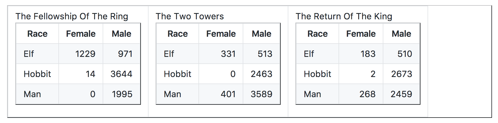

```{r setup, include = FALSE}
knitr::opts_chunk$set(echo = TRUE, comment = "")
```

## Requiremnts
```{r, message = FALSE}
# Install packages
# install.packages("tidyverse")

# Load packages
library(tidyverse)

# LotR Data
lotr_tidy_pre <- read_csv("https://raw.githubusercontent.com/UBC-R-Study-group/studyGroup/gh-pages/lessons/20210331/data/lotr_tidy.csv")
fellowship <- read_csv("https://raw.githubusercontent.com/UBC-R-Study-group/studyGroup/gh-pages/lessons/20210331/data/The_Fellowship_Of_The_Ring.csv")
towers <- read_csv("https://raw.githubusercontent.com/UBC-R-Study-group/studyGroup/gh-pages/lessons/20210331/data/The_Two_Towers.csv")
king <- read_csv("https://raw.githubusercontent.com/UBC-R-Study-group/studyGroup/gh-pages/lessons/20210331/data/The_Return_Of_The_King.csv")

# EDAWR Data
cases <- read_csv(
  "https://raw.githubusercontent.com/UBC-R-Study-group/studyGroup/gh-pages/lessons/20210331/data/EDAWR_cases.csv"
)
storms <- read_csv(
  "https://raw.githubusercontent.com/UBC-R-Study-group/studyGroup/gh-pages/lessons/20210331/data/EDAWR_storms.csv"
)
```


## Outline

1. [Why Tidy?](#why-tidy)
2. [How to Tidy](#how-to-tidy)
    - Challenge Question 1
3. [Other useful functions from tidyr](#other-useful-functions-from-tidyr): Separate and Unite
    - Challenge Question 2
4. [Final Example](#final-example)
5. [Further Reading](#further-reading)
6. [Solutions](#solutions) for Challenge Questions

## Why Tidy?

### Tidy Data and Data Analysis Pipeline


### What is tidy data?
* Every column in your dataframe represents a variable
* Every row represents an observation

This is also known as "long" data format.


### Why do we need tidy data?
* Consistent data structure - easier to manipulate
* Preferred format for `dplyr`, `mutate`, and `ggplot2`


### Example of untidy data (Jenny Bryan, STAT545)


### Example of *tidy* data


### Consider the differences...
* What are the variables and observations?
* What makes the first set tidy while the second is untidy?
    - What is human-readable (untidy), v.s. computer-readable (tidy)?
* How would you figure out:
    - What's the total number of words spoken by male hobbits in all three
    movies?
    - Is there a more talkative `Race`? 

Using a previously saved & tidied dataset, we can see it is very easy to
manipulate the tidy version:
```{r, message = FALSE}
lotr_tidy_pre %>% 
  count(Sex, Race, wt = Words)

lotr_tidy_pre %>%
  group_by(Race) %>%
  summarize(Words = sum(Words))
```


## How to Tidy

### How do we turn the LotR tables into a tidy dataframe?
Let's look at one of these untidy dataframes:
```{r, message = FALSE}
fellowship
```


Collect untidy dataframes into one dataframe:
```{r}
(lotr_untidy <- bind_rows(fellowship, towers, king))
```

This dataframe is still untidy because "word count" is spread out between two
columns, `Male` and `Female`. So to make this dataframe tidy, we need to:

- `pivot_longer()` to combine the word counts into one column
- Create a new column for `Sex`

Time to make this dataframe tidy!

```{r}
(lotr_tidy <- pivot_longer(
  lotr_untidy, 
  names_to  = "Sex", 
  values_to = "Words",
  cols = c(Female, Male)
))
```


### Un-tidying data
Sometimes you want a wide or untidy dataset - for example, making a table for
human eyes. `pivot_wider()` is another tidyr function that converts a dataframe
from the long format to the wide format. How would you convert the `lotr_tidy`
dataframe back into the `lotr_untidy` dataframe?
```{r}
pivot_wider(
  data = lotr_tidy, 
  names_from  = "Sex", 
  values_from = "Words"
)
```


### Challenge Question 1
In the EDAWR dataset, `cases`, we have the number of tuberculosis cases reported
in France, Germany and United States from 2011 to 2013. What are the total
number of tuberculosis cases reported over three years for each country?
```{r}
cases

# Challenge code here!
```


## Other useful functions from tidyr

### Separate and Unite
Let's use the EDAWR dataset again. This time, we are going to use the `storms`
data, which has the maximum wind speeds for six Atlantic hurricanes.
```{r}
storms
```

`separate()` allows you to separate a column into multiple other columns by
using a separator. For example, if we want to separate the `date` column into
`year`, `month`, `day`, we can do that by:
```{r}
(storms_sep <- separate(
  data = storms,
  col  = date,
  into = c("year", "month", "day"),
  sep  = "-"
))
```

### Challenge Question 2
How do you combine the three separate columns, `year`, `month`, `day`, that you
just created in `storms.sep` back into one column, `date`? Hint: `unite()` works
the opposite way as `separate()`.
```{r eval = FALSE}
# Code for Challenge Question 2
storms_new <- unite(...)
```

### Removing NA Values
Another useful function from tidy is `drop_na` which as you can guess, allows
us to remove rows containing NA values from our dataframe/tibble. You can apply
this function to the dataframe as a whole (i.e. all columns), or provide a 
specific column. Let's look at an example:
```{r}
smiths
drop_na(smiths)
```

## Further Reading

#### More tutorials
Further examples and more in-depth coverage:

* Jenny Bryan's [LOTR GitHub Repo](https://github.com/jennybc/lotr-tidy), with
the Lord of the Rings dataset
* [wmhall's
tutorial](https://github.com/wmhall/tidyr_lesson/blob/master/tidyr_lesson.md)
* [Hadley Wickham's R for Data Science
Textbook](http://r4ds.had.co.nz/tidy-data.html) and [journal
article](http://vita.had.co.nz/papers/tidy-data.pdf) on tidy data


#### Reshape2
Another package available, covering a wider array of data reshaping tools than
tidyr. In reshape2

* `melt` performs the function of `pivot_longer`
* `cast` performs the function of `pivot_wider`


## Solutions

#### Challenge 1
In the EDAWR dataset, `cases`, we have the number of tuberculosis cases reported
in France, Germany and United States from 2011 to 2013. What are the total
number of tuberculosis cases reported over three years for each country?
```{r}
pivot_longer(
  cases,
  names_to = "year",
  values_to = "cases",
  cols = c(`2011`, `2012`, `2013`)
) %>%
  group_by(country) %>%
  summarize(cases = sum(cases))
```


### Challenge 2
How do you combine the three separate columns, `year`, `month`, `day`, that you
just created in `storms.sep` back into one column, `date`? Hint: `unite()` works
the opposite way as `separate()`.
```{r}
unite(
  data = storms_sep, 
  col = date, 
  c("year", "month", "day"), 
  sep = "-"
)
```
