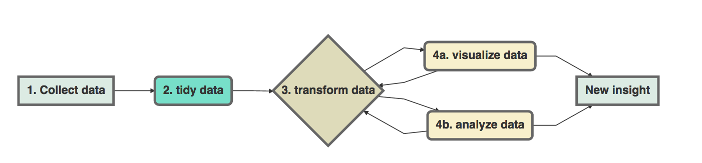

A Tutorial on Tidy Data
================
Travis Blimkie
March 31st, 2021

## Requiremnts

``` r
# Install packages
# install.packages("tidyverse")

# Load packages
library(tidyverse)

# LotR Data
lotr_tidy_pre <- read_csv("https://raw.githubusercontent.com/UBC-R-Study-group/studyGroup/gh-pages/lessons/20210331/data/lotr_tidy.csv")
fellowship <- read_csv("https://raw.githubusercontent.com/UBC-R-Study-group/studyGroup/gh-pages/lessons/20210331/data/The_Fellowship_Of_The_Ring.csv")
towers <- read_csv("https://raw.githubusercontent.com/UBC-R-Study-group/studyGroup/gh-pages/lessons/20210331/data/The_Two_Towers.csv")
king <- read_csv("https://raw.githubusercontent.com/UBC-R-Study-group/studyGroup/gh-pages/lessons/20210331/data/The_Return_Of_The_King.csv")

# EDAWR Data
cases <- read_csv(
  "https://raw.githubusercontent.com/UBC-R-Study-group/studyGroup/gh-pages/lessons/20210331/data/EDAWR_cases.csv"
)
storms <- read_csv(
  "https://raw.githubusercontent.com/UBC-R-Study-group/studyGroup/gh-pages/lessons/20210331/data/EDAWR_storms.csv"
)
```

## Outline

1.  [Why Tidy?](#why-tidy)
2.  [How to Tidy](#how-to-tidy)
      - Challenge Question 1
3.  [Other useful functions from
    tidyr](#other-useful-functions-from-tidyr): Separate and Unite
      - Challenge Question 2
4.  [Final Example](#final-example)
5.  [Further Reading](#further-reading)
6.  [Solutions](#solutions) for Challenge Questions

## Why Tidy?

### Tidy Data and Data Analysis Pipeline



### What is tidy data?

  - Every column in your dataframe represents a variable
  - Every row represents an observation

This is also known as “long” data format.

### Why do we need tidy data?

  - Consistent data structure - easier to manipulate
  - Preferred format for `dplyr`, `mutate`, and `ggplot2`

### Example of untidy data (Jenny Bryan, STAT545)


### Example of *tidy* data


### Consider the differences…

  - What are the variables and observations?
  - What makes the first set tidy while the second is untidy?
      - What is human-readable (untidy), v.s. computer-readable (tidy)?
  - How would you figure out:
      - What’s the total number of words spoken by male hobbits in all
        three movies?
      - Is there a more talkative `Race`?

Using a previously saved & tidied dataset, we can see it is very easy to
manipulate the tidy version:

``` r
lotr_tidy_pre %>% 
  count(Sex, Race, wt = Words)
```

    # A tibble: 6 x 3
      Sex    Race       n
      <chr>  <chr>  <dbl>
    1 Female Elf     1743
    2 Female Hobbit    16
    3 Female Man      669
    4 Male   Elf     1994
    5 Male   Hobbit  8780
    6 Male   Man     8043

``` r
lotr_tidy_pre %>%
  group_by(Race) %>%
  summarize(Words = sum(Words))
```

    # A tibble: 3 x 2
      Race   Words
      <chr>  <dbl>
    1 Elf     3737
    2 Hobbit  8796
    3 Man     8712

## How to Tidy

### How do we turn the LotR tables into a tidy dataframe?

Let’s look at one of these untidy dataframes:

``` r
fellowship
```

    # A tibble: 3 x 4
      Film                       Race   Female  Male
      <chr>                      <chr>   <dbl> <dbl>
    1 The Fellowship Of The Ring Elf      1229   971
    2 The Fellowship Of The Ring Hobbit     14  3644
    3 The Fellowship Of The Ring Man         0  1995

Collect untidy dataframes into one dataframe:

``` r
(lotr_untidy <- bind_rows(fellowship, towers, king))
```

    # A tibble: 9 x 4
      Film                       Race   Female  Male
      <chr>                      <chr>   <dbl> <dbl>
    1 The Fellowship Of The Ring Elf      1229   971
    2 The Fellowship Of The Ring Hobbit     14  3644
    3 The Fellowship Of The Ring Man         0  1995
    4 The Two Towers             Elf       331   513
    5 The Two Towers             Hobbit      0  2463
    6 The Two Towers             Man       401  3589
    7 The Return Of The King     Elf       183   510
    8 The Return Of The King     Hobbit      2  2673
    9 The Return Of The King     Man       268  2459

This dataframe is still untidy because “word count” is spread out
between two columns, `Male` and `Female`. So to make this dataframe
tidy, we need to:

  - `pivot_longer()` to combine the word counts into one column
  - Create a new column for `Sex`

Time to make this dataframe tidy\!

``` r
(lotr_tidy <- pivot_longer(
  lotr_untidy, 
  names_to  = "Sex", 
  values_to = "Words",
  cols = c(Female, Male)
))
```

    # A tibble: 18 x 4
       Film                       Race   Sex    Words
       <chr>                      <chr>  <chr>  <dbl>
     1 The Fellowship Of The Ring Elf    Female  1229
     2 The Fellowship Of The Ring Elf    Male     971
     3 The Fellowship Of The Ring Hobbit Female    14
     4 The Fellowship Of The Ring Hobbit Male    3644
     5 The Fellowship Of The Ring Man    Female     0
     6 The Fellowship Of The Ring Man    Male    1995
     7 The Two Towers             Elf    Female   331
     8 The Two Towers             Elf    Male     513
     9 The Two Towers             Hobbit Female     0
    10 The Two Towers             Hobbit Male    2463
    11 The Two Towers             Man    Female   401
    12 The Two Towers             Man    Male    3589
    13 The Return Of The King     Elf    Female   183
    14 The Return Of The King     Elf    Male     510
    15 The Return Of The King     Hobbit Female     2
    16 The Return Of The King     Hobbit Male    2673
    17 The Return Of The King     Man    Female   268
    18 The Return Of The King     Man    Male    2459

### Un-tidying data

Sometimes you want a wide or untidy dataset - for example, making a
table for human eyes. `pivot_wider()` is another tidyr function that
converts a dataframe from the long format to the wide format. How would
you convert the `lotr_tidy` dataframe back into the `lotr_untidy`
dataframe?

``` r
pivot_wider(
  data = lotr_tidy, 
  names_from  = "Sex", 
  values_from = "Words"
)
```

    # A tibble: 9 x 4
      Film                       Race   Female  Male
      <chr>                      <chr>   <dbl> <dbl>
    1 The Fellowship Of The Ring Elf      1229   971
    2 The Fellowship Of The Ring Hobbit     14  3644
    3 The Fellowship Of The Ring Man         0  1995
    4 The Two Towers             Elf       331   513
    5 The Two Towers             Hobbit      0  2463
    6 The Two Towers             Man       401  3589
    7 The Return Of The King     Elf       183   510
    8 The Return Of The King     Hobbit      2  2673
    9 The Return Of The King     Man       268  2459

### Challenge Question 1

In the EDAWR dataset, `cases`, we have the number of tuberculosis cases
reported in France, Germany and United States from 2011 to 2013. What
are the total number of tuberculosis cases reported over three years for
each country?

``` r
cases
```

    # A tibble: 3 x 4
      country `2011` `2012` `2013`
      <chr>    <dbl>  <dbl>  <dbl>
    1 FR        7000   6900   7000
    2 DE        5800   6000   6200
    3 US       15000  14000  13000

``` r
# Challenge code here!
```

## Other useful functions from tidyr

### Separate and Unite

Let’s use the EDAWR dataset again. This time, we are going to use the
`storms` data, which has the maximum wind speeds for six Atlantic
hurricanes.

``` r
storms
```

    # A tibble: 6 x 4
      storm    wind pressure date      
      <chr>   <dbl>    <dbl> <date>    
    1 Alberto   110     1007 2000-08-03
    2 Alex       45     1009 1998-07-27
    3 Allison    65     1005 1995-06-03
    4 Ana        40     1013 1997-06-30
    5 Arlene     50     1010 1999-06-11
    6 Arthur     45     1010 1996-06-17

`separate()` allows you to separate a column into multiple other columns
by using a separator. For example, if we want to separate the `date`
column into `year`, `month`, `day`, we can do that by:

``` r
(storms_sep <- separate(
  data = storms,
  col  = date,
  into = c("year", "month", "day"),
  sep  = "-"
))
```

``` 
# A tibble: 6 x 6
  storm    wind pressure year  month day  
  <chr>   <dbl>    <dbl> <chr> <chr> <chr>
1 Alberto   110     1007 2000  08    03   
2 Alex       45     1009 1998  07    27   
3 Allison    65     1005 1995  06    03   
4 Ana        40     1013 1997  06    30   
5 Arlene     50     1010 1999  06    11   
6 Arthur     45     1010 1996  06    17   
```

### Challenge Question 2

How do you combine the three separate columns, `year`, `month`, `day`,
that you just created in `storms.sep` back into one column, `date`?
Hint: `unite()` works the opposite way as `separate()`.

``` r
# Code for Challenge Question 2
storms_new <- unite(...)
```

### Removing NA Values

Another useful function from tidy is `drop_na` which as you can guess,
allows us to remove rows containing NA values from our dataframe/tibble.
You can apply this function to the dataframe as a whole (i.e. all
columns), or provide a specific column. Let’s look at an example:

``` r
smiths
```

    # A tibble: 2 x 5
      subject     time   age weight height
      <chr>      <dbl> <dbl>  <dbl>  <dbl>
    1 John Smith     1    33     90   1.87
    2 Mary Smith     1    NA     NA   1.54

``` r
drop_na(smiths)
```

    # A tibble: 1 x 5
      subject     time   age weight height
      <chr>      <dbl> <dbl>  <dbl>  <dbl>
    1 John Smith     1    33     90   1.87

## Further Reading

#### More tutorials

Further examples and more in-depth coverage:

  - Jenny Bryan’s [LOTR GitHub
    Repo](https://github.com/jennybc/lotr-tidy), with the Lord of the
    Rings dataset
  - [wmhall’s
    tutorial](https://github.com/wmhall/tidyr_lesson/blob/master/tidyr_lesson.md)
  - [Hadley Wickham’s R for Data Science
    Textbook](http://r4ds.had.co.nz/tidy-data.html) and [journal
    article](http://vita.had.co.nz/papers/tidy-data.pdf) on tidy data

#### Reshape2

Another package available, covering a wider array of data reshaping
tools than tidyr. In reshape2

  - `melt` performs the function of `pivot_longer`
  - `cast` performs the function of `pivot_wider`

## Solutions

#### Challenge 1

In the EDAWR dataset, `cases`, we have the number of tuberculosis cases
reported in France, Germany and United States from 2011 to 2013. What
are the total number of tuberculosis cases reported over three years for
each country?

``` r
pivot_longer(
  cases,
  names_to = "year",
  values_to = "cases",
  cols = c(`2011`, `2012`, `2013`)
) %>%
  group_by(country) %>%
  summarize(cases = sum(cases))
```

    # A tibble: 3 x 2
      country cases
      <chr>   <dbl>
    1 DE      18000
    2 FR      20900
    3 US      42000

### Challenge 2

How do you combine the three separate columns, `year`, `month`, `day`,
that you just created in `storms.sep` back into one column, `date`?
Hint: `unite()` works the opposite way as `separate()`.

``` r
unite(
  data = storms_sep, 
  col = date, 
  c("year", "month", "day"), 
  sep = "-"
)
```

    # A tibble: 6 x 4
      storm    wind pressure date      
      <chr>   <dbl>    <dbl> <chr>     
    1 Alberto   110     1007 2000-08-03
    2 Alex       45     1009 1998-07-27
    3 Allison    65     1005 1995-06-03
    4 Ana        40     1013 1997-06-30
    5 Arlene     50     1010 1999-06-11
    6 Arthur     45     1010 1996-06-17
